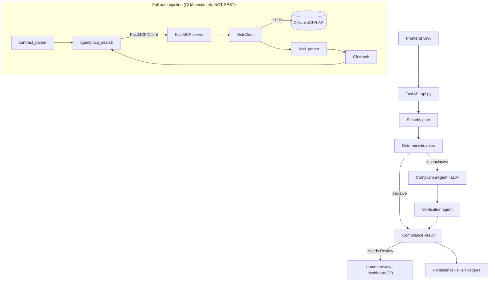
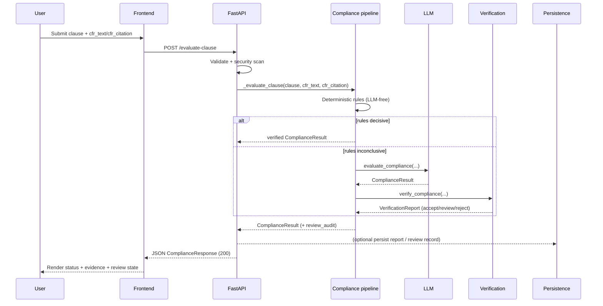
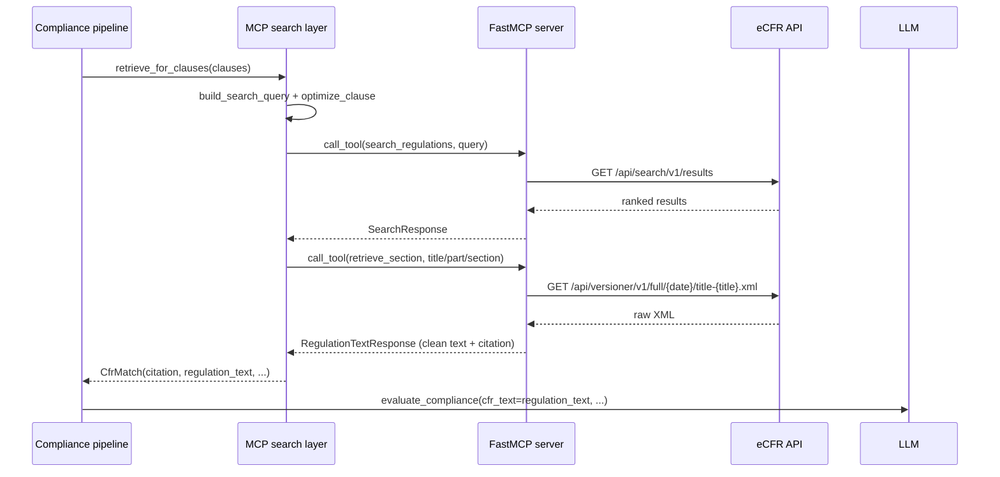

# CFR Compliance MCP — Frontend Integration & System Workflow Guide

**A detailed technical handoff for frontend and full-stack integration**

**Prepared by: Vaibhav Vikas Ranjan**

> Audience: a senior full-stack/frontend developer who needs to build a ChatGPT/Claude-style
> assistant on top of this backend. It does not assume prior knowledge of the AI/backend internals.
>
> Method: This document was produced by extracting the actual ZIP, reading the real source files,
> and tracing every code path. The **implementation is the source of truth**. Where the README or
> in-code docstrings conflict with what the code actually does, the discrepancy is called out
> explicitly (see the two `⚠️ CRITICAL FINDING` blocks). Every important claim carries a
> `File: …` / `Function: …` reference so you can verify it yourself.

---

## Table of Contents

1. [Executive Summary](#part-1--executive-summary)
2. [Complete Repository Map](#part-2--complete-repository-map)
3. [API Endpoint Documentation](#part-3--api-endpoint-documentation-for-the-frontend-developer)
4. [Detailed Single Clause Workflow](#part-4--detailed-single-clause-workflow)
5. [MCP + eCFR Retrieval Explained](#part-5--mcp--ecfr-retrieval-explanation)
6. [LLM Integration](#part-6--llm-integration)
7. [Frontend Data Contract](#part-7--frontend-data-contract)
8. [Recommended ChatGPT/Claude-Like Frontend Flow](#part-8--recommended-chatgptclaude-like-frontend-flow)
9. [Error and Loading States](#part-9--error-and-loading-states)
10. [Security Boundaries](#part-10--security-boundaries-important-for-frontend)
11. [Persistence, Analysis History and Human Review](#part-11--persistence-analysis-history-and-human-review)
12. [File-by-File Frontend Relevance Table](#part-12--file-by-file-frontend-relevance-table)
13. [Exact Field Origin Trace](#part-13--exact-field-origin-trace)
14. [Frontend Implementation Recommendation](#part-14--frontend-implementation-recommendation)
15. [Sample End-to-End Request](#part-15--sample-end-to-end-request)
16. [Mermaid Architecture Diagrams](#part-16--mermaid-architecture-diagrams)
17. [Current Limitations](#part-17--current-limitations)
18. [What the Frontend Developer Needs to Know](#final-section--what-the-frontend-developer-needs-to-know)

---

# PART 1 — Executive Summary

## Project
**CFR Compliance MCP** (repo: `cfr-compliance-mcp`, current commit `ee18d9a`, branch `main`, Python 3.12+).

## Purpose
A production-oriented AI compliance system that evaluates a **contract clause** against **U.S. federal
regulations (the Code of Federal Regulations, CFR)** and returns a verdict:

- **Compliant**
- **Non-Compliant**
- **Needs Review** (human-in-the-loop — the system refuses to auto-finalize uncertain results)

It deliberately does **not** let an LLM freely invent law. The design enforces an authority hierarchy:

1. **Authoritative CFR text** (from the official eCFR API) — the only source of regulatory truth.
2. **Deterministic rules** — fast, LLM-free, auditable verdicts.
3. **LLM reasoning** — only as a fallback when deterministic rules are inconclusive, and it must
   ground every claim in the provided CFR text.
4. **Verification agent** — cross-checks the LLM's output; conflicts route to `Needs Review`.
5. **Advisory Compliance Memory** — prior outcomes are *context, never law*.
6. **Human review** — an explicit lifecycle for `Needs Review` items, with an immutable audit trail.

## Frontend Goal
A frontend developer can turn this backend into an interface like ChatGPT/Claude where a user
submits a clause and receives a structured compliance analysis. Because this is a **REST + JSON**
system (no token streaming — see [Part 8](#part-8)), the frontend submits a JSON request, shows a
loading state, and renders a structured result card (status badge, reason, evidence/citation,
verification state, review state).

### ⚠️ CRITICAL FINDING #1 — The REST API does NOT retrieve CFR itself
The FastAPI REST endpoints (`/evaluate-clause`, `/evaluate-bulk`) **do not** call the MCP/eCFR
retrieval pipeline. They require the **caller to supply the CFR regulation text and citation**
(`cfr_text`, `cfr_citation`) in the request body. If you omit `cfr_text`, you get
`status = "Needs Review"` with the reason *"No CFR regulation text was supplied…"*.

The full auto-retrieval pipeline (`run_compliance_pipeline` → MCP → eCFR) **exists and works**, but it
is wired to the **CLI / benchmark** path, **not** to the REST API. This is the single most important
thing to know before you build the frontend, and it is treated in depth in
[Part 4](#part-4--detailed-single-clause-workflow), [Part 5](#part-5--mcp--ecfr-retrieval-explanation)
and [Part 13](#part-13--exact-field-origin-trace).

### ⚠️ CRITICAL FINDING #2 — `cfr_text` is not returned to the frontend
`cfr_text` (the full regulation text) is consumed **inside the backend** (it is put into the LLM
prompt and into evidence) but it is **not** a top-level field of the API response. The response
carries `evidence[]`, each entry with a `text_span` (a verbatim quote/excerpt) and a `citation`.
So the frontend renders **evidence passages**, not the full regulation body.

### Reference architecture (matches the actual implementation)

```text
USER
  │
  ▼
FRONTEND CHAT / CLAUSE UI
  │
  │ POST /evaluate-clause  (or /evaluate-bulk)
  ▼
FASTAPI BACKEND (api.py)
  │
  ▼
SECURITY + VALIDATION (agent/security.py — prompt injection, title, length)
  │
  ▼
DETERMINISTIC RULES (agent/deterministic_rules.py — LLM-free)
  │
  ▼
LLM COMPLIANCE AGENT (agent/compliance_agent.py — fallback only)
  │
  ▼
VERIFICATION AGENT (agent/verification_agent.py)
  │
  ▼
ComplianceResult  ──►  Needs Review? ──► Human review (dashboard/DB)
  │
  ▼
JSON RESPONSE (ComplianceResponse)
  │
  ▼
FRONTEND UI
```

> Note: the official eCFR retrieval block is intentionally NOT in the REST request path above.
> It sits in the *other* pipeline (`run_compliance_pipeline`). The REST path expects the caller to
> have already obtained the CFR text (see Finding #1). Part 8 explains your integration options.

---

# PART 2 — Complete Repository Map

The repository layout (only files that actually exist; `docs/` and sample PDFs under `contracts/`
exist in the working checkout but are local artifacts, not part of the ZIP):

```text
cfr-compliance-mcp/
├── api.py                     # FastAPI REST service (the HTTP entry point for the frontend)
├── dashboard.py               # Server-rendered Jinja2 dashboard routes (mounted into api.py)
├── agent/
│   ├── __init__.py
│   ├── models.py              # Domain models: Clause, EvidencePassage, ReviewAudit, ComplianceResult
│   ├── compliance_pipeline.py # Full auto pipeline: retrieval→rules→LLM→verify (CLI/benchmark path)
│   ├── compliance_agent.py    # LLM evaluation (Agno + direct OpenAI-compatible HTTP call)
│   ├── mcp_search.py          # Retrieval layer: builds query → MCP server → eCFR → CfrMatch
│   ├── cfr_query_optimizer.py # Deterministic CFR-domain query optimizer (keyword tables)
│   ├── deterministic_rules.py # LLM-free rule engine (3 rules)
│   ├── verification_agent.py  # Cross-checks LLM output; recommends accept/review/reject
│   ├── security.py            # Prompt-injection detection, sanitization, length/title gates
│   ├── contract_parser.py     # PDF → text → split into Clause objects (CLI path)
│   ├── memory.py              # ComplianceMemory: advisory, durable, fail-open
│   ├── memory_store.py        # Append-only JSONL store for memory records
│   ├── reporting.py           # ReportRecord/ClauseReport models + atomic JSON persistence
│   └── persistence/
│       ├── __init__.py        # Backend selection (file | postgres), fail-fast
│       ├── base.py            # PersistenceRepository protocol + exceptions
│       ├── file_repository.py # Filesystem backend (history only; no review)
│       ├── postgres_repository.py # Optional PostgreSQL backend (history + review)
│       ├── inmemory_repository.py # In-memory backend (tests)
│       ├── models.py          # AnalysisSummary, ReviewItem, ReviewDetail, ReviewState, etc.
│       └── review_lifecycle.py# Review state machine (needs_review→under_review→approved/rejected/escalated)
├── src/cfr_compliance_mcp/
│   ├── server.py              # FastMCP server entrypoint; registers the 8 tools
│   ├── config.py              # Typed Settings (env-driven)
│   ├── constants.py           # eCFR endpoint paths + bounds
│   ├── exceptions.py          # Ecfr*/Xml* error hierarchy
│   ├── logging_config.py      # Logging setup (JSON/text)
│   ├── clients/
│   │   ├── http_client.py     # Generic async HTTP client (retry, rate limit, backoff)
│   │   └── ecfr_client.py     # eCFR-specific client (titles, search, retrieve, versions, agencies)
│   ├── parsing/
│   │   └── xml_parser.py      # Raw eCFR XML → clean text + Citation (no network)
│   ├── cache/
│   │   └── cache_backend.py   # In-memory cache backend
│   ├── models/
│   │   ├── requests.py        # Pydantic input models for the 8 tools
│   │   └── responses.py       # Pydantic output models for the 8 tools
│   └── tools/
│       ├── __init__.py        # Registers the 8 tool factories
│       ├── _common.py         # cached_call, build_error_response, perform_search
│       ├── search_regulations.py
│       ├── search_by_keyword.py
│       ├── retrieve_section.py
│       ├── retrieve_part.py
│       ├── retrieve_title.py
│       ├── get_title_structure.py
│       ├── get_version_history.py
│       └── list_agencies.py
├── templates/                 # Jinja2 dashboard templates (base, _macros, dashboard/*)
├── static/css/dashboard.css   # Dashboard styling
├── migrations/0001_initial_schema.sql  # PostgreSQL schema (review/history tables)
├── scripts/migrate.py         # SQL migration runner
├── benchmark/compliance_benchmark.py   # Deterministic benchmark harness (uses full pipeline)
├── tests/                     # Offline, PostgreSQL integration, live-LLM, regression suites
├── compose.yaml               # Docker Compose (app + Postgres 16 + migration job)
├── Dockerfile
├── pyproject.toml             # Dependencies + tooling config
├── uv.lock
├── README.md
└── .env.example               # All configuration variables (copy to .env)
```

### api.py
```
Purpose:
    Main FastAPI REST application.

Important responsibilities:
    - CORS middleware + OpenTelemetry tracing setup
    - Request/response Pydantic models (ClauseInput, ComplianceResponse, ...)
    - Structured, safe error handling (never leaks internals)
    - POST /evaluate-clause, POST /evaluate-bulk
    - GET /analyses, GET /analyses/{id}, GET /reviews, POST /reviews/{...}/decide
    - Mounts the dashboard router and /static
    - Instantiates the persistence repository (file | postgres)

Frontend relevance:
    PRIMARY HTTP entry point. All JSON you will call lives here.
```
`File: api.py`

### agent/models.py
```
Purpose:
    Single source of truth for domain objects.

Important:
    - Clause(title, text, clause_id)  — dataclass; clause_id = sha256(title|text)[:8]
    - EvidencePassage — CFR evidence with provenance (source, retrieved_at, ...)
    - ReviewAudit     — human-in-the-loop audit trail
    - ComplianceResult — the verdict object (status/confidence/reason/evidence/...)

Frontend relevance:
    ComplianceResult drives the response shape; evidence drives the citation cards.
```

### agent/compliance_pipeline.py
```
Purpose:
    Full auto pipeline: retrieve_for_clauses → per-match security → deterministic → LLM → verify.

Frontend relevance:
    NOT called by the REST API. Used by CLI/benchmark. Relevant if you add backend auto-retrieval.
```

### src/cfr_compliance_mcp/server.py + tools + clients + parsing
```
Purpose:
    The FastMCP server exposing 8 typed tools over the official eCFR API.

Frontend relevance:
    Indirect. The REST API does not use it. Relevant only if the frontend (or a backend enhancement)
    needs to obtain CFR text before calling /evaluate-clause.
```

### dashboard.py / templates / static
```
Purpose:
    Server-rendered human-review dashboard (read-mostly; no React, no WebSockets).

Frontend relevance:
    Reference UI for how authoritative evidence vs advisory memory vs NEEDS_REVIEW are rendered.
```

### agent/persistence/*
```
Purpose:
    Persistence abstraction: analysis history + human review workflow.

Frontend relevance:
    Powers /analyses and /reviews endpoints. Postgres required for review; file backend history-only.
```

---

# PART 3 — API Endpoint Documentation for the Frontend Developer

All endpoints live in `api.py`. Response/request shapes below are taken directly from the Pydantic
models. The full OpenAPI schema is served at **`/api/docs`** (Swagger) and `/api/redoc`.

> **Base URL** (default local): `http://localhost:8000` (see `compose.yaml` / README).

---

## 3.1 `GET /health`
- **Purpose:** Liveness check (process up).
- **Response:**
  ```json
  { "status": "healthy", "service": "cfr-compliance-mcp", "llm_available": "True" }
  ```
  (`File: api.py` → `health_check`, line 829)

## 3.2 `GET /health/ready`
- **Purpose:** Readiness; reflects whether the persistence backend is usable. Postgres is pinged
  when configured. Never includes DSNs/secrets.
- **Response:** `{"status": "ready", "backend": "file"}` or 503 `{"status": "not_ready", ...}`.

---

## 3.3 `POST /evaluate-clause`  ← **primary endpoint**

- **Purpose:** Evaluate a single contract clause.
- **Processing flow:**
  ```text
  POST /evaluate-clause
      ↓  ClauseInput (Pydantic validation; 422 on failure)
      ↓  _clause_from_input → Clause
      ↓  _security_scan (prompt injection / title / length) → 400 on block
      ↓  _evaluate_clause
      │     - if no cfr_text → Needs Review ("No CFR regulation text was supplied...")
      │     - sanitize_cfr_text
      │     - Compliance Memory lookup (optional)
      │     - evaluate_deterministic  (LLM-free)
      │        - decisive → verified result
      │     - LLM fallback (only if LLM_AVAILABLE) → evaluate_compliance
      │     - verify_compliance → reject/review → Needs Review; accept → verified
      ↓  _response_from_result → ComplianceResponse
  ```
- **Request body** (`ClauseInput`, `File: api.py:286`):
  ```json
  {
    "clause_title": "Termination Clause",
    "clause_text": "The contractor may ...",
    "cfr_title": 40,
    "cfr_citation": "40 CFR 257.3",
    "cfr_text": "Full regulation text of the cited section..."
  }
  ```
  - `clause_title` (required, ≤500 chars). Alias: `title`.
  - `clause_text` (required, ≤500,000 chars, must be non-empty). Alias: `text`.
  - `cfr_title` (optional int 1–50).
  - `cfr_citation` (optional str ≤200), e.g. `"40 CFR 257.3"`.
  - `cfr_text` (optional str ≤2,000,000). **Required for an evidence-grounded verdict.**
  - ⚠️ If `cfr_text` is empty, the result is `status="Needs Review"` (200 OK, not an error).

- **Example request (alias form):**
  ```json
  {
    "title": "Office Cleaning",
    "text": "Contractor shall clean the office weekly.",
    "cfr_citation": "40 CFR 261.10",
    "cfr_text": "Hazardous waste must be disposed per EPA requirements."
  }
  ```

- **Response** (`ComplianceResponse`, `File: api.py:365`):
  ```json
  {
    "clause_title": "Office Cleaning",
    "clause_id": "3f2a9c1b",
    "status": "Non-Compliant",
    "confidence": 0.8,
    "reason": "Clause mentions none of the CFR's required topics; CFR has mandatory language",
    "evidence": [
      {
        "title": 40,
        "citation": "40 CFR 261.10",
        "text_span": "Hazardous waste must be disposed per EPA requirements.",
        "part": null,
        "section": null,
        "date": null
      }
    ],
    "verified": true,
    "verification_notes": "",
    "verification_status": "verified",
    "memory_participated": false,
    "review_audit": {
      "final_status": "Non-Compliant",
      "proposed_status": "Non-Compliant",
      "proposed_confidence": 0.8,
      "review_reason": "",
      "verifier_recommendation": "not_run",
      "verifier_notes": "",
      "deterministic_status": "Non-Compliant",
      "evidence_citations": ["40 CFR 261.10"],
      "reviewed_at": "2026-08-26T00:00:00+00:00"
    }
  }
  ```

- **Important frontend fields:**
  | Field | Display? | Notes |
  |---|---|---|
  | `status` | Yes | Badge: `Compliant` / `Non-Compliant` / `Needs Review` |
  | `reason` | Yes | Human-readable explanation |
  | `confidence` | Yes | 0–1 |
  | `clause_title` | Yes | Echo of input |
  | `clause_id` | Yes | Use as React key / stable id |
  | `evidence[]` | Yes | Citation card(s): `citation`, `text_span`, `date` |
  | `verified` | Yes | Boolean |
  | `verification_status` | Yes | `verified` / `needs_review` / `not_verified` |
  | `review_audit` | Yes (review UI) | Explains *why* review is needed |
  | `verification_notes` | Yes | Verifier conflict/notes |
  | `memory_participated` | Yes | Show "historical memory" advisory badge if true |

---

## 3.4 `POST /evaluate-bulk`

- **Purpose:** Evaluate up to 200 clauses. Accepts **either** a JSON array of `ClauseInput` **or** an
  object `{"clauses": [...]}` (`File: api.py:915`).
- **Request (array form):**
  ```json
  [ { "clause_title": "A", "clause_text": "...", "cfr_citation": "...", "cfr_text": "..." } ]
  ```
- **Request (object form):**
  ```json
  { "clauses": [ { "clause_title": "A", "clause_text": "..." } ] }
  ```
- **Response** (`BulkComplianceResponse`, `File: api.py:429`):
  ```json
  {
    "total_clauses": 2,
    "compliant": 1,
    "non_compliant": 0,
    "needs_review": 1,
    "results": [ { "...ComplianceResponse as above..." } ]
  }
  ```
- **Note:** A security-blocked or errored item is included as a `Needs Review` result (200), not an
  error. Bulk evaluation optionally persists a report when `CFR_REPORTS_DIR` is set or the backend is
  postgres (see Part 11).

---

## 3.5 Analysis history

### `GET /analyses` — paginated history
- Query params: `status` (`compliant|non_compliant|needs_review`), `limit` (1–200, default 50),
  `offset` (≥0).
- Response (`AnalysisListResponse`): `{ "items": [AnalysisSummary...], "total", "limit", "offset" }`.
  `AnalysisSummary` = `analysis_id, generated_at, contract_id, total_clauses, compliant, non_compliant, needs_review`.

### `GET /analyses/{analysis_id}` — full immutable report
- Response is a `ReportRecord` (`File: agent/reporting.py:72`):
  ```json
  {
    "analysis_id": "analysis-20260826T120000-abcd1234",
    "contract_id": null,
    "generated_at": "...",
    "total_clauses": 1,
    "compliant": 0,
    "non_compliant": 1,
    "needs_review": 0,
    "clauses": [
      {
        "clause_id": "...", "clause_title": "...", "status": "...", "confidence": 0.8,
        "reason": "...", "evidence": [ {...EvidencePassage...} ],
        "verification_status": "verified", "review_reason": "",
        "review_audit": { ... }, "memory_participated": false
      }
    ]
  }
  ```
- 404 if not found.

---

## 3.6 Human review

### `GET /reviews` — review queue
- Query: `state` (`needs_review|under_review|approved|rejected|escalated`), `limit`, `offset`.
  Defaults to actionable `needs_review`.
- Response (`ReviewListResponse`): `{ "items": [ReviewItem...], "total", "limit", "offset" }`.
- ⚠️ With the default `file` backend, this returns **HTTP 501** (`review_not_supported`) because the
  review workflow requires PostgreSQL. Frontend must handle 501.

### `GET /reviews/{analysis_id}/{clause_id}` — full review view
- Response (`ReviewDetail`, `File: agent/persistence/models.py:86`): includes the original automated
  result (`original_status`, `reason`, `confidence`, `evidence`, `review_audit`), the current
  `review_state`, `version` (optimistic concurrency), `reviewer_identity`, `decision_reason`,
  `decided_at`, and immutable `events[]`.

### `POST /reviews/{analysis_id}/{clause_id}/decide` — record a review decision
- **Request** (`ReviewDecisionRequest`):
  ```json
  {
    "target_state": "approved",
    "reason": "Verified against 40 CFR 257.3",
    "reviewer_identity": "jane.doe",
    "expected_version": 3
  }
  ```
- **Behavior:** transitions the review record (never overwrites the original automated result) with
  optimistic concurrency via `expected_version`.
- **Errors:** 404 missing; 409 invalid transition / version conflict; 422 malformed; 501 file backend.
- **Review lifecycle** (`File: agent/persistence/review_lifecycle.py`):
  `needs_review → under_review → {approved, rejected, escalated}`.

---

## 3.7 Dashboard routes
`/dashboard`, `/dashboard/analyses`, `/dashboard/analyses/{id}`, `/dashboard/reviews`,
`/dashboard/reviews/{analysis_id}/{clause_id}`, plus the POST decide form handler — all HTML
(server-rendered). Not for a JSON frontend, but a useful visual reference.

---

# PART 4 — Detailed Single Clause Workflow

The most important section. **I trace the request exactly as the current REST API handles it**, and
then separately describe the *full* auto-retrieval pipeline (used by CLI/benchmark) because that is
where `match.citation` / `match.regulation_text` come from.

## 4A. The REST API path (`POST /evaluate-clause`) — what the frontend calls today

| # | Step | File / Function | Input → Output | Async | Network | LLM | Failure |
|---|------|-----------------|----------------|-------|---------|-----|---------|
| 1 | User enters clause | — | clause text in UI | — | — | — | — |
| 2 | Frontend POSTs JSON | `api.py` → `evaluate_single_clause` (async def, line 862) | JSON body → `ClauseInput` | async handler | no | no | 422 validation |
| 3 | Validate request | `ClauseInput` Pydantic (line 286) | body → validated model | sync | no | no | 422 `validation_error` |
| 4 | Build `Clause` | `_clause_from_input` (line 462) | `ClauseInput` → `Clause(title, text)`; `clause_id` computed | sync | no | no | — |
| 5 | Security scan | `_security_scan` → `agent/security.py check_clause_security` | `Clause` → `{safe, reason}` | sync | no | no | 400 HTTPException (blocked) |
| 6 | (Optional) memory | `_evaluate_clause` → `agent/memory.py retrieve` | — | sync | no (file) | no | fail-open → `none` |
| 7 | Deterministic rules | `agent/deterministic_rules.py evaluate_deterministic` | clause + cfr_text → `ComplianceResult` | sync | no | no | fallback to LLM |
| 8 | LLM (fallback) | `agent/compliance_agent.py evaluate_compliance` | clause + cfr_citation + cfr_text (+history) → `ComplianceResult` | sync (blocking httpx) | **yes (LLM)** | **yes** | → Needs Review |
| 9 | Enrich evidence | `_api_enrich_evidence` (line 557) | sets `source=eCFR`, `retrieval_method=caller_supplied` | sync | no | no | — |
| 10 | Verify | `agent/verification_agent.py verify_compliance` | result + clause + cfr_text → `VerificationReport` | sync | no | no | → Needs Review |
| 11 | Build result | `_evaluate_clause` | → `ComplianceResult` (+ `ReviewAudit`) | sync | no | no | → Needs Review |
| 12 | Serialize | `_response_from_result` (line 789) | `ComplianceResult` → `ComplianceResponse` | sync | no | no | — |
| 13 | Return | FastAPI | `ComplianceResponse` → JSON (200) | — | — | — | 500 sanitized |

**Key facts about the REST path:**
- The endpoint is declared `async def`, but the evaluation body (`_evaluate_clause`) runs
  **synchronously** (including the blocking `httpx.Client` LLM call inside `evaluate_compliance`).
  There is **no** streaming, SSE, WebSocket, or background job. The request blocks until the whole
  evaluation (including any LLM call) completes.
- `cfr_citation` / `cfr_text` **come from the request body**, not from eCFR (Finding #1).
- If `cfr_text` is missing/blank → `Needs Review` with reason *"No CFR regulation text was supplied,
  so no evidence-grounded verdict is possible…"* (`api.py:613`).
- If deterministic rules decide → verified with `verifier_recommendation="not_run"` (no LLM, no network).
- If rules are inconclusive and no LLM is configured (`LLM_AVAILABLE` false) → Needs Review
  (`api.py:685`).
- Any internal exception during evaluation → caught and downgraded to a `Needs Review` result with
  reason *"Evaluation failed due to an internal error; manual review required."* (`api.py:901`) — the
  HTTP status is still 200.
- **Security block** is the one case that returns HTTP **400** (`api.py:884`).

## 4B. The full auto-retrieval pipeline (CLI / benchmark) — where `CfrMatch.citation` and `regulation_text` live

This path is what the README diagram describes, and what the task's data object refers to. It is
**not** currently reachable via the REST API.

| # | Step | File / Function | Input → Output | Network | LLM |
|---|------|-----------------|----------------|---------|-----|
| 1 | Parse contract | `agent/contract_parser.py` → `ContractParser.extract_text` + `split_into_clauses` | PDF → `[Clause]` | no | no |
| 2 | Retrieve | `agent/mcp_search.py` → `retrieve_for_clauses` | `[Clause]` → `[CfrMatch]` | **yes (MCP→eCFR)** | no |
| 3 | Evaluate each | `agent/compliance_pipeline.py` → `_evaluate_match` | `CfrMatch` → `ComplianceResult` | no | **yes (fallback)** |
| 4 | Orchestrate | `run_compliance_pipeline` (line 447) | `[Clause]` → `[ComplianceResult]` | yes | yes |

`retrieve_for_clause` (`agent/mcp_search.py:501`):
1. `build_search_query(clause)` → keyword query (boilerplate stripped).
2. `optimize_clause(...)` → domain-anchored query + predicted title (`agent/cfr_query_optimizer.py`).
3. `_search_results` → call MCP tool `search_regulations` (`src/cfr_compliance_mcp/tools/search_regulations.py`).
4. `_select_best_candidate` → pick highest-ranked *usable* hit.
5. `_retrieve_text` → call MCP tool `retrieve_section` (or `retrieve_part`) → clean text + citation.
6. `_fetch_version_history` → call MCP tool `get_version_history` → derive effective version.
7. Build `CfrMatch(citation, regulation_text, part, section, date, version, ...)`.

`CfrMatch` is the dataclass in `agent/mcp_search.py:84` with fields `citation`, `regulation_text`,
`error`, `part`, `section`, `heading`, `date`, `version`, `source`, `retrieval_method`,
`retrieved_at`, `effective_version`, `version_specific`, `version_payload`.

This is where the task's `match.citation` and `match.regulation_text` come from in the full pipeline.
`_evaluate_match` then passes `match.citation` and `match.regulation_text` into the LLM
(`agent/compliance_pipeline.py:354`) and attaches provenance from `match` to evidence
(`_enrich_evidence`, line 30).

---

# PART 5 — MCP + eCFR Retrieval Explanation

## How does the system find the correct CFR regulation?
In the **full pipeline**, retrieval is:

```text
Compliance Pipeline (run_compliance_pipeline)
      ↓
agent/mcp_search.py retrieve_for_clause(s)
      ↓  build_search_query + optimize_clause
      ↓  call MCP tool search_regulations  (FastMCP Client over stdio)
      ↓
FastMCP server (src/cfr_compliance_mcp/server.py)
      ↓  search_regulations tool → EcfrClient.search()
      ↓
EcfrClient (clients/ecfr_client.py) → HttpClient (clients/http_client.py)
      ↓  GET https://www.ecfr.gov/api/search/v1/results?query=...
      ↓
Official eCFR API → JSON results
      ↓  pick best candidate (title/part/section)
      ↓  call MCP tool retrieve_section → EcfrClient.retrieve_section
      ↓  GET .../api/versioner/v1/full/{date}/title-{title}.xml?part=..&section=..
      ↓
Raw XML → parsing/xml_parser.py parse_regulation_xml → clean text + Citation
      ↓
CfrMatch(citation=..., regulation_text=...)
```

### Is the frontend directly calling eCFR?
**NO.** The frontend talks only to the FastAPI REST API. It never calls eCFR, never talks to the MCP
server, and never holds an eCFR client. In fact, the REST API doesn't call eCFR either — `cfr_text`
and `cfr_citation` are supplied by the caller (Finding #1).

### What external API is actually contacted?
- **eCFR (official, public, no auth):** base URL `https://www.ecfr.gov` (default; override with
  `ECFR_BASE_URL`). Endpoint constants in `src/cfr_compliance_mcp/constants.py`:
  - `/api/versioner/v1/titles.json`
  - `/api/versioner/v1/full/{date}/title-{title}.xml`
  - `/api/versioner/v1/versions/title-{title}.json`
  - `/api/search/v1/results`
  - `/api/admin/v1/agencies.json`
- **LLM provider (OpenAI-compatible):** default `https://atm.accure.ai/v1` (see Part 6).

### Where does the citation come from?
- In the **full pipeline**: `agent/mcp_search.py` `_retrieve_text` builds it from the tool's
  `citation` metadata via `_format_citation(title, part, section)` (line 187), e.g. `"40 CFR 257.3"`.
  It is stored as `CfrMatch.citation`.
- In the **REST API**: `cfr_citation` is taken from the request body; if omitted it defaults to
  `f"{cfr_title or 0} CFR"` (`api.py:897`).

### Where does the regulation text come from?
- In the **full pipeline**: `_retrieve_text` calls the MCP `retrieve_section`/`retrieve_part` tool,
  which fetches raw XML from eCFR's `/full/` endpoint and runs it through
  `parse_regulation_xml` (`src/cfr_compliance_mcp/parsing/xml_parser.py`). The result is a clean,
  LLM-readable plain-text version of **that one section (or part)**, stored as
  `CfrMatch.regulation_text`.
- In the **REST API**: `cfr_text` comes from the request body and is passed straight into the LLM and
  into deterministic rules.

### Is the retrieved regulation authoritative?
Yes — when it comes from the official eCFR API it is authoritative federal law text. The trust
boundary:
- **Authoritative:** eCFR text, `CfrMatch.citation`, `date`, `version` (from eCFR metadata).
- **Caller-supplied (REST path):** the API labels provenance `retrieval_method="caller_supplied"` and
  `source="eCFR"` even though it cannot verify the caller's text came from eCFR — it never fabricates
  version/date metadata it doesn't have (`api.py:557` `_api_enrich_evidence`). The system does not
  claim authority it cannot prove.
- **LLM:** never a source of law or provenance (see Part 6).

### Caching / versioning (actually implemented)
- **eCFR client caching:** in-process caches for latest-date-per-title and full-title XML
  (`clients/ecfr_client.py:67-68`). Plus an MCP-level cache backend (`cache/cache_backend.py`,
  memory default, TTL 3600s) used by tools via `cached_call`.
- **Version-aware retrieval:** the pipeline fetches version history, derives the effective version
  (max issue date), and best-effort re-fetches the section text for that version
  (`agent/mcp_search.py:448-607`). `version_specific` distinguishes historical vs current text.
- **Client rate limiting:** 60 req/min self-imposed (`config.py ecfr_max_requests_per_minute`).

---

# PART 6 — LLM Integration

- **File that initializes the LLM:** `agent/compliance_agent.py`.
- **Provider/model config (env):**
  - `ATM_API_KEY` (preferred credential) — also gates `LLM_AVAILABLE` in `api.py:131`.
  - `ATM_BASE_URL` (default `https://atm.accure.ai/v1`) — OpenAI-compatible endpoint.
  - `ATM_MODEL` (default `nvidia/nemotron-3-nano-omni`).
  - `OPENAI_API_KEY` (fallback credential). Base URL/model then use ATM defaults.
  - Read by `_llm_api_key()` / `_llm_base_url()` / `_llm_model()` (`compliance_agent.py:406-418`).
- **Is it OpenAI-compatible?** Yes. `ComplianceAgent` constructs an Agno `OpenAIChat` model, but the
  actual call is a **direct HTTP POST** to `{base_url}/chat/completions` with
  `response_format={"type":"json_object"}` and `temperature=0` (`compliance_agent.py:179-213`).
- **What calls the LLM:** `evaluate_compliance(...)` → `ComplianceAgent.evaluate(...)`.
  - Called by `api._evaluate_clause` (REST path) and `agent.compliance_pipeline._evaluate_match`
    (full pipeline, via `asyncio.to_thread`).
- **What structured result is expected:** a JSON object with `status`, `confidence`, `reason`,
  `evidence[]` (each evidence: `title`, `part`, `section`, `date`, `text_span`, `citation`). Validated
  into a `ComplianceResult` via `ComplianceResult.model_validate` (`compliance_agent.py:284`).
- **How malformed LLM responses are handled:** 
  - Non-JSON / empty / unparseable → `RuntimeError` → routed to `Needs Review` by the caller.
  - Status normalized (`compliant`→`Compliant`, etc.); unknown status → `Needs Review`
    (`compliance_agent.py:256-270`).
  - Confidence clamped to 0–1 (`:252`).
  - Missing reason → default text + routed to review (`:272`).
  - `_coerce_evidence` defensively sanitizes each evidence dict; malformed entries fall back to safe
    values instead of failing the whole result (`:293`).
- **Is the LLM allowed to generate regulatory citations?** It may *describe* citations only if they
  appear in the provided CFR text. The system prompt mandates: "Never invent a title, part, section,
  citation, or quote that does not appear in the provided regulation text." The caller **overwrites**
  `clause_title` and `clause_id` with its own values after the LLM responds (`compliance_agent.py:249`).
- **How evidence provenance is controlled:** the LLM is explicitly told it is never the authority for
  `source`/`retrieved_at`/`retrieval_method`/`version`/`date`. `_coerce_evidence` **drops** any such
  fields (resets `date` to `""`). Provenance is then attached by the retrieval/enrichment layer:
  `_enrich_evidence` (full pipeline) or `_api_enrich_evidence` (REST path).

### Trace

```text
Clause + Authoritative CFR Context (+ Optional Advisory Memory)
      ↓
ComplianceAgent._build_prompt  (CONTRACT CLAUSE + CFR REGULATION + HISTORICAL_CONTEXT block)
      ↓
HTTP POST {base_url}/chat/completions  (OpenAI-compatible, temp 0, JSON mode)
      ↓
Raw response → json.loads → normalize → coerce evidence
      ↓
ComplianceResult
      ↓
Verification agent → accept/review/reject
```

### Authoritative vs Advisory vs AI-generated (critical for UI labels)

| Category | Data | Source | UI label suggestion |
|----------|------|--------|---------------------|
| **Authoritative** | `cfr_citation`, `cfr_text` (pipeline), `evidence[].citation`, `evidence[].text_span`, `evidence[].date` | Official eCFR API (or caller-supplied in REST path) | **"Official Regulation"** |
| **AI-generated** | `status`, `confidence`, `reason` (when from LLM), evidence `text_span` excerpts | `agent/compliance_agent.py` | **"AI Analysis"** |
| **Advisory/Historical** | `memory_participated=true`, any memory-driven context | `agent/memory.py` (JSONL) | **"Historical/Advisory Context"** (never as law) |
| **Human review** | `Needs Review` status, `review_audit`, review queue | persistence/review lifecycle | **"Human Review Required"** |

---

# PART 7 — Frontend Data Contract

Practical contract for the objects the frontend will actually exchange. Field names verified against
the source.

## Request: `ClauseInput` (`api.py:286`)
| Field | Type | Required | Meaning | Source |
|---|---|---|---|---|
| `clause_title` (alias `title`) | string | yes (≤500) | Clause heading | frontend |
| `clause_text` (alias `text`) | string | yes (≤500k, non-empty) | Clause body | frontend |
| `cfr_title` | int | no (1–50) | CFR title hint | frontend |
| `cfr_citation` | string | no (≤200) | e.g. `"40 CFR 257.3"` | frontend (or pipeline) |
| `cfr_text` | string | no (≤2M) | **Required for evidence-grounded verdict** | frontend (or pipeline) |

## Response: `ComplianceResponse` (`api.py:365`)
| Field | Type | Source | Meaning | Frontend Usage |
|---|---|---|---|---|
| `clause_title` | string | echo of request / `ComplianceResult` | clause heading | header |
| `clause_id` | string | backend (sha256 of title+text, 8 chars) | unique id | React key / history |
| `status` | enum string | evaluation | `Compliant`/`Non-Compliant`/`Needs Review` | badge |
| `confidence` | number 0–1 | evaluation | confidence | progress bar |
| `reason` | string | rules / LLM | explanation | body text |
| `evidence` | array | evaluation (LLM excerpts + provenance) | CFR passages | citation cards |
| `verified` | boolean | verification | passed verification | ✓/✗ indicator |
| `verification_notes` | string | verifier | conflicts/notes | tooltip/panel |
| `verification_status` | enum | verification | `verified`/`needs_review`/`not_verified` | status pill |
| `memory_participated` | boolean | memory layer | historical memory influenced result | advisory badge |
| `review_audit` | object \| null | pipeline | why (not) finalized | review panel |

### `evidence[]` entry (`EvidencePassageOut`, `api.py:340`)
| Field | Type | Meaning |
|---|---|---|
| `title` | int | CFR title number |
| `citation` | string | e.g. `"40 CFR 257.3"` |
| `text_span` | string | verbatim CFR excerpt (what the decision cited) |
| `part` | string \| null | CFR part |
| `section` | string \| null | CFR section |
| `date` | string \| null | as-of date (empty on REST/caller path) |

### `review_audit` entry (`ReviewAuditOut`, `api.py:351`)
| Field | Type | Meaning |
|---|---|---|
| `final_status` | string | final outcome |
| `proposed_status` | string | what was proposed (before verification) |
| `proposed_confidence` | number | proposed confidence |
| `review_reason` | string | why review required |
| `verifier_recommendation` | string | `accept`/`review`/`reject`/`not_run`/`memory_reuse` |
| `verifier_notes` | string | verifier detail |
| `deterministic_status` | string | rule status (or `blocked_by_security`/`evaluation_error`/`memory_reuse`) |
| `evidence_citations` | array | citation strings |
| `reviewed_at` | string | ISO timestamp |

> Note: there is **no** `cfr_text` or `clause_text` in the response. If the frontend needs to display
> the full regulation, it must have sent/fetched it itself, or use `evidence[].text_span`.

## Error body: `APIError` (`api.py:414`)
```json
{ "error": "validation_error", "message": "Request validation failed",
  "details": [ {"loc": ["body","clause_text"], "msg": "...", "type": "..."} ] }
```
| `error` code | HTTP | Trigger |
|---|---|---|
| `validation_error` | 422 | malformed request |
| `internal_error` | 500 | unhandled exception (sanitized) |
| `analysis_not_found` | 404 | unknown analysis |
| `review_not_found` | 404 | no review record |
| `invalid_transition` | 409 | bad review state transition |
| `concurrency_conflict` | 409 | stale `expected_version` |
| `review_not_supported` | 501 | review on file backend |
| *(plain 400)* | 400 | security scan rejected the clause |

---

# PART 8 — Recommended ChatGPT/Claude-Like Frontend Flow

## Does the current backend support streaming?
**No.** There is no `StreamingResponse`, SSE (`text/event-stream`), WebSocket, or background job
anywhere in the codebase (verified by search). All endpoints are plain, synchronous REST requests that
return a complete JSON body. `/evaluate-clause` (and each bulk item) blocks until evaluation finishes
— including any LLM call (up to 60s per LLM request, `compliance_agent.py:216`). A multi-clause bulk
request can therefore take a while.

Because there is no `cfr_text` auto-retrieval in the REST path, and no streaming, the "ChatGPT-like"
flow must be a **request → loading → full response** pattern.

### Recommended frontend interaction

```text
USER TYPES: "Is this clause compliant?" + clause text
      ↓
FRONTEND
  POST /evaluate-clause
  (optionally supply cfr_title / cfr_citation / cfr_text)
      ↓
LOADING STATE (staged messages)
  "Analyzing clause..."
  "Retrieving federal regulations..."   ← only if frontend fetches CFR first
  "Evaluating compliance..."
  "Verifying evidence..."
      ↓
FINAL RESPONSE (render a result card)
  ┌──────────────────────────────────────┐
  │ Compliance Status: COMPLIANT /        │
  │ NON-COMPLIANT / NEEDS REVIEW          │
  ├──────────────────────────────────────┤
  │ AI Analysis  (reason + confidence)    │
  ├──────────────────────────────────────┤
  │ Relevant Regulation                  │
  │  40 CFR 257.3                        │
  │  (evidence[].citation / text_span)   │
  ├──────────────────────────────────────┤
  │ Verification Status  (verified / ...) │
  ├──────────────────────────────────────┤
  │ [Human Review Required] (if review)   │
  └──────────────────────────────────────┘
```

## Current implementation (today)
- Synchronous `fetch`/`axios` POST; show a spinner/progress until `Promise` resolves.
- Render `ComplianceResponse` fields directly.

## Optional future enhancement (to get real ChatGPT-like streaming)
To stream tokens, the backend would need new work — not present today:
1. **Wire `run_compliance_pipeline` into the API** so the backend auto-retrieves CFR from eCFR
   (currently only CLI/benchmark use it). This is the biggest gap for a self-contained "paste a
   clause" experience.
2. **Add a streaming endpoint** (e.g. `POST /evaluate-clause/stream`) returning an SSE
   (`text/event-stream`) or WebSocket channel that emits staged progress events (`retrieving`,
   `evaluating`, `verifying`, `done`) and ultimately the final JSON. Today the LLM call is blocking
   and JSON-only, so streaming would require `temperature` control, incremental response parsing, and
   job state on the server.
3. Optionally move long evaluations to a background task + polling endpoint.

These are enhancements, not current behavior.

---

# PART 9 — Error and Loading States

The backend exposes **statuses** (not a formal client state machine). Map your UI states as follows:

| Frontend state | Backend trigger | API behavior | Recommended message | Retry | Edit clause? | Human review? |
|---|---|---|---|---|---|---|
| `IDLE` | — | — | initial prompt | — | — | no |
| `SUBMITTING` | POST in flight | in-flight | "Analyzing clause…" | — | — | no |
| `SUCCESS` | `status` = Compliant/Non-Compliant | 200, `verified=true` | show result | optional | no | no |
| `NEEDS_REVIEW` | `status` = "Needs Review", `verification_status` = `needs_review` | 200 | show reason + "Human review required" | optional | maybe | **yes** |
| `SECURITY_BLOCKED` | injection/title/length gate fails | **400** HTTPException (single), or Needs-Review item (bulk) | "Clause rejected by security scan" | no | **yes** | yes (bulk) |
| `LLM_FAILED` / `RETRIEVAL_FAILED` | LLM error, no CFR text, retrieval error | downgraded to `Needs Review` (200) or generic | "Evaluation failed; manual review required" | yes | maybe | yes |
| `VALIDATION_ERROR` | malformed request | 422 `validation_error` | show field errors | fix input | yes | no |
| `SERVER_ERROR` | unhandled | 500 `internal_error` (sanitized) | "Unexpected internal error" | yes | no | no |
| `REVIEW_NOT_SUPPORTED` | review endpoint on file backend | 501 `review_not_supported` | "Review requires PostgreSQL backend" | — | — | via DB backend |

**Important:**
- Many "failures" are represented as a successful `Needs Review` **with 200**, not an error. So the
  frontend must distinguish `status == "Needs Review"` from a transport/HTTP error.
- The only non-200 outcome of `/evaluate-clause` is: **400** (security block), **422** (validation),
  **500** (internal). Always parse the `APIError` body `{error, message, details}`.

---

# PART 10 — Security Boundaries Important for Frontend

The backend implements (`agent/security.py`):
- **Prompt-injection detection** (`detect_prompt_injection`): regex patterns for "ignore previous
  instructions", system-prompt extraction attempts, "always answer X", role-playing, boundary markers.
- **Input sanitization** (`sanitize_clause_text`, `sanitize_cfr_text`): truncation to limits,
  null-byte/control-char removal, whitespace normalization.
- **Text limits:** clause ≤ 500,000 chars; CFR ≤ 2,000,000 chars (`_MAX_CLAUSE_TEXT_CHARS`,
  `_MAX_CFR_TEXT_CHARS`). Validation also enforces these at the Pydantic layer (`ClauseInput`).
- **Title validation** (`validate_cfr_title`): 1–50 only.
- **Unsafe content handling:** a suspicious clause is rejected before any evaluation runs
  (`check_clause_security`); the single-clause endpoint returns HTTP 400; bulk marks the item
  `Needs Review`. The verification agent also re-checks injection as a red flag → `reject`.
- **How blocked requests are represented:** `400` + `detail` for single; `Needs Review` item in bulk.
  Errors never leak stack traces, exception strings, or internal details (`api.py` exception handlers;
  `tests/test_error_safety` asserts no secret leakage).

### What the frontend must NEVER contain / expose
```text
LLM API keys                    (ATM_API_KEY / OPENAI_API_KEY)
Database credentials            (CFR_DATABASE_URL)
Internal eCFR credentials       (none exist — eCFR is public, but keep backend-only anyway)
Backend environment variables   (.env)
Internal system prompts         (_COMPLIANCE_REVIEWER_INSTRUCTIONS)
```
The keys live only in the backend environment (`.env` / server env). The frontend should call your
backend's `/evaluate-clause` (and optionally the MCP server if you expose it) — never the LLM or
database directly.

### CORS
`api.py:118` enables `CORSMiddleware` with:
- `allow_origins = os.getenv("CORS_ORIGINS", "*").split(",")` → default `"*"`.
- `allow_credentials=True`, `allow_methods=["*"]`, `allow_headers=["*"]`.

For a browser SPA, set `CORS_ORIGINS=https://your-frontend-domain` in `.env` (comma-separated). With
the default `*` plus `allow_credentials=True`, browsers may reject credentialed requests — set an
explicit origin for production.

---

# PART 11 — Persistence, Analysis History and Human Review

```text
Compliance Result
      ↓
Report / Persistence  (FileRepository JSON OR PostgresRepository)
      ↓
Analysis ID  (e.g. "analysis-20260826T120000-abcd1234")
      ↓
History API   GET /analyses, GET /analyses/{id}
      ↓
Review Queue  GET /reviews  (Postgres only)
      ↓
Human Decision  POST /reviews/{id}/{clause}/decide
      ↓
Immutable Audit Event  (append-only transition log)
```

- **File persistence (default):** `/evaluate-bulk` writes a `ReportRecord` as atomic JSON under
  `CFR_REPORTS_DIR` (via `agent/reporting.py` `save_report`). No secrets/full contract body stored.
  History endpoints work; **review endpoints return 501** (`agent/persistence/file_repository.py`).
- **Optional PostgreSQL:** `CFR_PERSISTENCE_BACKEND=postgres` + `CFR_DATABASE_URL`. Applies schema
  via `scripts/migrate.py` (`migrations/0001_initial_schema.sql`). Postgres enables queryable history
  **and** the transactional review workflow with **optimistic concurrency** (`expected_version`) and
  **immutable events** (`agent/persistence/postgres_repository.py`, `review_lifecycle.py`).
- **Fail-fast, no silent fallback:** selecting postgres without a URL, or an unreachable DB at
  startup, fails clearly (`api.py` lifespan; `agent/persistence/__init__.py`).

### Frontend pages you can build
- **Analysis History Page** — `GET /analyses?status=&limit=&offset=`; show summary cards
  (`analysis_id`, `generated_at`, counts), paginate.
- **Clause Detail Page** — `GET /analyses/{analysis_id}`; show per-clause results, evidence,
  verification, `review_audit`.
- **Review Queue** — `GET /reviews?state=needs_review` (Postgres required); actionable items.
- **Human Review Screen** — `GET /reviews/{analysis_id}/{clause_id}`; show the immutable automated
  result + evidence + audit + event history; submit decision via
  `POST /reviews/{analysis_id}/{clause_id}/decide` with `target_state`, `reason`,
  `reviewer_identity`, `expected_version`. Handle 409 (conflict → refresh version) and 501 (file backend).

---

# PART 12 — File-by-File Frontend Relevance Table

| File | Purpose | Important Functions | Frontend Relevance |
|---|---|---|---|
| `api.py` | FastAPI REST service | `evaluate_single_clause`, `evaluate_bulk_clauses`, `list_analyses`, `get_analysis`, `list_reviews`, `get_review`, `decide_review`, `health_check`, `readiness_check` | **Primary API to call** |
| `agent/models.py` | Domain models | `Clause`, `EvidencePassage`, `ReviewAudit`, `ComplianceResult` | Drives response + evidence shapes |
| `agent/compliance_pipeline.py` | Full auto pipeline | `run_compliance_pipeline`, `_evaluate_match` | Not in REST path; candidate for auto-retrieval enhancement |
| `agent/compliance_agent.py` | LLM evaluation | `evaluate_compliance`, `ComplianceAgent.evaluate`, `_llm_*` config | Source of `status`/`confidence`/`reason`/evidence excerpts |
| `agent/mcp_search.py` | Retrieval layer | `retrieve_for_clauses`, `retrieve_for_clause`, `CfrMatch`, `build_search_query` | Where `match.citation`/`regulation_text` originate (full pipeline) |
| `agent/cfr_query_optimizer.py` | Query optimizer | `optimize_clause` | Improves retrieval relevance (not frontend-visible) |
| `agent/deterministic_rules.py` | LLM-free rules | `evaluate_deterministic`, `rule_1/2/3_*` | Produces some verdicts without LLM/network |
| `agent/verification_agent.py` | Verification | `verify_compliance`, `VerificationReport` | Sets `verified`/`verification_status` |
| `agent/security.py` | Security | `check_clause_security`, `detect_prompt_injection`, `sanitize_*`, `validate_cfr_title` | Why some clauses return 400 / Needs Review |
| `agent/contract_parser.py` | PDF → clauses | `ContractParser`, `split_into_clauses` | Only for CLI; not REST |
| `agent/memory.py` | Advisory memory | `ComplianceMemory`, `get_compliance_memory` | Sets `memory_participated` (advisory badge) |
| `agent/memory_store.py` | Memory JSONL | `MemoryStore` | Storage for advisory memory |
| `agent/reporting.py` | Report persistence | `build_report`, `save_report`, `ReportRecord` | Shapes `GET /analyses/{id}` body |
| `agent/persistence/*` | Persistence + review | `get_persistence_repository`, `FileRepository`, `PostgresRepository`, `review_lifecycle` | Powers history + review endpoints; file=501 on review |
| `src/cfr_compliance_mcp/server.py` | FastMCP server | `create_app`, `main`, tool registration | eCFR retrieval server; not called by REST |
| `src/cfr_compliance_mcp/clients/ecfr_client.py` | eCFR client | `search`, `retrieve_section/part/title`, `get_version_history` | Where authoritative CFR text is fetched |
| `src/cfr_compliance_mcp/clients/http_client.py` | HTTP client | `get`, retry/backoff/rate-limit | Underlies eCFR client |
| `src/cfr_compliance_mcp/parsing/xml_parser.py` | XML → clean text | `parse_regulation_xml`, `Citation` | Produces `regulation_text` / citation in full pipeline |
| `src/cfr_compliance_mcp/tools/*` | 8 MCP tools | `search_regulations`, `retrieve_section`, ... | The MCP tool contract |
| `src/cfr_compliance_mcp/config.py` | Settings | `get_settings`, `Settings` | Env config (CORS, memory, persistence, LLM, eCFR) |
| `dashboard.py` | Server-rendered UI | `dashboard_index`, `analyses_list`, `review_detail`, `review_decide` | Reference for human-review UI; not for JSON frontend |
| `templates/*`, `static/*` | Dashboard markup/CSS | — | Style/UX reference |
| `migrations/*`, `scripts/migrate.py` | DB schema + runner | — | Required for review features |
| `benchmark/compliance_benchmark.py` | Benchmark harness | uses `run_compliance_pipeline` | Example of full auto pipeline usage |
| `compose.yaml`, `Dockerfile` | Deployment | — | Run full stack (app + Postgres) |
| `.env.example` | Config reference | — | All env vars the backend reads |

---

# PART 13 — Exact Field Origin Trace

This section traces the exact data object from the request:

```python
{
    "clause_title": clause.title,
    "clause_text": clause.text,
    "cfr_citation": match.citation,
    "cfr_text": match.regulation_text,
}
```

**Important context:** this exact object is what the **full auto pipeline** builds (where `match` is
a `CfrMatch`). The **REST API** builds an equivalent object but with `cfr_citation`/`cfr_text` coming
from the caller instead of `match`. Both traces are given.

## `clause_title`
```
REST path:
  Frontend request
    ↓
  ClauseInput.clause_title (or alias "title")     [api.py:299]
    ↓
  Clause.title                                     [agent/models.py:19]  (via _clause_from_input, api.py:462)
    ↓
  CompliancePipeline._evaluate_clause  → passed into LLM prompt & result  [api.py]
    ↓
  ComplianceResult.clause_title  →  ComplianceResponse.clause_title  →  JSON  [api.py:809]
```
- **First entry point:** the frontend request body (required).
- **Not** extracted from a contract in the REST path. (In the full pipeline it comes from
  `split_into_clauses` in `agent/contract_parser.py`, which reads PDF `SECTION n.` headings.)
- **Stored in:** `Clause.title` (dataclass).
- **Consumed by:** `_evaluate_clause`, `_security_scan`, `evaluate_compliance`, `_api_needs_review`,
  `_response_from_result`.
- **LLM note:** the caller overwrites the LLM's version of the title — the model is told never to
  rewrite it (`compliance_agent.py:97-99, 249`).

## `clause_text`
```
REST path:
  Frontend request
    ↓
  ClauseInput.clause_text (or alias "text")        [api.py:305]
    ↓
  sanitize_clause_text  (null bytes, control chars, whitespace, ≤500k)   [agent/security.py:116]
    ↓
  Clause.text                                     [agent/models.py:20]
    ↓
  Security: detect_prompt_injection                [agent/security.py:63]
    ↓
  _evaluate_clause → LLM prompt (user prompt, never system)              [compliance_agent.py _build_prompt]
```
- **Origin:** frontend request body (required, non-empty, ≤500,000 chars).
- **Sanitization/security:** yes — truncated, null/control chars removed, whitespace normalized;
  prompt-injection detection runs and can block (400) or reject.
- **Length limit:** 500,000 chars (both Pydantic and security layers).
- **Modified before LLM:** yes — `_security_scan` replaces `clause.text` with the sanitized version
  if anything changed (`api.py:511-515`).
- **Prompt-injection detection:** yes (`check_clause_security` → `detect_prompt_injection`), plus a
  secondary check inside the verifier.

## `cfr_citation`
```
FULL pipeline path:
  Frontend request (n/a) → CLI/benchmark
    ↓
  Official eCFR API  (search results hierarchy: title/part/section)
    ↓
  MCP tool search_regulations → SearchResultItem.hierarchy
    ↓
  agent/mcp_search.py _select_best_candidate → (title, part, section)
    ↓
  _retrieve_text → tool citation metadata → _format_citation(title, part, section)
    ↓
  CfrMatch.citation                            [agent/mcp_search.py:104, 595]
    ↓
  compliance_pipeline._evaluate_match → LLM kwargs["cfr_citation"]        [compliance_pipeline.py:357]
    ↓
  _enrich_evidence → EvidencePassage.citation (provenance)               [compliance_pipeline.py:54]
    ↓
  ComplianceResult.evidence[].citation  →  ComplianceResponse.evidence[].citation  →  JSON

REST path:
  Frontend request cfr_citation (or default "N CFR")                     [api.py:897]
    ↓
  _evaluate_clause → LLM kwargs["cfr_citation"]                          [api.py:701]
    ↓
  _api_enrich_evidence → EvidencePassage.citation                        [api.py:557]
    ↓
  ComplianceResponse.evidence[].citation → JSON
```
- **Not invented by the LLM.** Either from the caller (REST) or from eCFR metadata (full pipeline).
- Frontend renders it in the **citation card** via `evidence[].citation`.

## `cfr_text`
```
FULL pipeline path:
  Official eCFR API → GET /api/versioner/v1/full/{date}/title-{title}.xml (raw XML)
    ↓
  EcfrClient.retrieve_section / retrieve_part                 [clients/ecfr_client.py:202,242]
    ↓
  parsing/xml_parser.py parse_regulation_xml → clean plain text + Citation   [parsing/xml_parser.py:392]
    ↓
  CfrMatch.regulation_text                                   [agent/mcp_search.py:105, 598]
    ↓
  compliance_pipeline._evaluate_match → LLM kwargs["cfr_text"] + deterministic rules  [pipeline:358,309]
    ↓
  EvidencePassage.text_span (verbatim excerpts, from LLM/rules)
    ↓
  ComplianceResponse.evidence[].text_span → JSON   (NOT the full cfr_text)

REST path:
  Frontend request cfr_text (caller-supplied)                              [api.py:319]
    ↓
  sanitize_cfr_text (≤2M chars)                                            [security.py:183]
    ↓
  _evaluate_clause → deterministic rules + LLM kwargs["cfr_text"]          [api.py:622,702]
    ↓
  EvidencePassage.text_span excerpts → ComplianceResponse.evidence[].text_span
```
- **Where `match.regulation_text` comes from:** the parsed, clean text of the retrieved eCFR section
  (or part) — i.e. directly from the official eCFR API via the MCP `retrieve_section`/`retrieve_part`
  tool, transformed by `xml_parser.py`. **Yes, the eCFR API is the source.**
- **XML is parsed:** yes — `parse_regulation_xml` converts raw eCFR XML to clean plain text and
  filters to the exact requested part/section node.
- **Full regulation vs extracted section:** it returns the **extracted section** (or part), not the
  whole title. `retrieve_section` is preferred; `retrieve_part` is the fallback when a hit has no
  section.
- **Passed into LLM:** yes, as `cfr_text` in the user prompt.
- **Stored in evidence:** not verbatim as a whole — evidence stores `text_span` excerpts (quotes) with
  citation. Provenance (`source`, `retrieved_at`, `retrieval_method`, `version`, `date`) is attached
  by the retrieval/enrichment layer.
- **Does the frontend receive it directly?** No. It receives `evidence[].text_span` + `citation`
  (indirect through the evidence/result structure). There is no top-level `cfr_text` field.

---

# PART 14 — Frontend Implementation Recommendation

Based on the actual API (synchronous REST + JSON), a clean architecture:

```text
frontend/
├── services/
│   └── complianceApi.ts        # typed fetch wrappers for /evaluate-clause, /evaluate-bulk,
│                               #   /analyses, /reviews, /health
├── hooks/
│   ├── useComplianceEvaluation.ts   # submit clause → {status, result, error}
│   └── useReviewDecision.ts         # optimistic-concurrency review submit
├── components/
│   ├── ClauseInput.tsx              # textarea + title + optional cfr fields
│   ├── ChatInterface.tsx            # ChatGPT-like message list + composer
│   ├── ComplianceResult.tsx         # renders ComplianceResponse
│   ├── StatusBadge.tsx              # Compliant / Non-Compliant / Needs Review
│   ├── RegulationEvidence.tsx       # evidence[] citation cards
│   ├── ReviewPanel.tsx              # review_audit + decision form (if reviewable)
│   └── AnalysisHistory.tsx          # /analyses list + detail
├── types/
│   └── compliance.ts               # TS interfaces mirroring the backend models
└── .env                            # VITE_API_BASE_URL, VITE_CORS_ORIGIN
```

### Recommended pages
1. **Chat / Clause Check** — paste a clause, see result card (primary).
2. **Analysis History** — list + detail (`/analyses`, `/analyses/{id}`).
3. **Review Queue** — `/reviews`, `/reviews/{analysis}/{clause}` (Postgres required).

### API service layer
A single module wrapping `fetch` with `credentials`, error mapping to `APIError`, and typed
generics. All endpoints are synchronous; use `Promise`.

### TypeScript interfaces (generated from backend models)
```ts
type ComplianceStatus = "Compliant" | "Non-Compliant" | "Needs Review";
type VerificationStatus = "verified" | "needs_review" | "not_verified";

interface EvidencePassageOut {
  title: number;
  citation: string;
  text_span: string;
  part: string | null;
  section: string | null;
  date: string | null;
}
interface ReviewAuditOut {
  final_status: string;
  proposed_status: string;
  proposed_confidence: number;
  review_reason: string;
  verifier_recommendation: string;
  verifier_notes: string;
  deterministic_status: string;
  evidence_citations: string[];
  reviewed_at: string;
}
interface ComplianceResponse {
  clause_title: string;
  clause_id: string;
  status: ComplianceStatus;
  confidence: number;
  reason: string;
  evidence: EvidencePassageOut[];
  verified: boolean;
  verification_notes: string;
  verification_status: VerificationStatus;
  memory_participated: boolean;
  review_audit: ReviewAuditOut | null;
}
interface BulkComplianceResponse {
  total_clauses: number; compliant: number; non_compliant: number; needs_review: number;
  results: ComplianceResponse[];
}
interface APIError { error: string; message: string; details?: Array<Record<string, unknown>>; }
```

### State management
Given the synchronous nature, a lightweight approach (React Query / SWR, or local state + a
`useComplianceEvaluation` hook) is sufficient. Track `status` (idle/submitting/success/error) +
`result` + `error`.

### Loading/error states
Map the table in Part 9: show staged progress messages during submit; on 200 with
`status==="Needs Review"` render the review panel; on `APIError` show the mapped message.

### CORS setup
Set `CORS_ORIGINS=https://your-frontend-domain` in the backend `.env`. Ensure the frontend origin is
in the allow-list.

### Environment variables (frontend)
- `VITE_API_BASE_URL` (backend base URL).
- `VITE_CORS_ORIGIN` (your origin, for local dev).
- **Never** put `ATM_API_KEY`, `OPENAI_API_KEY`, `CFR_DATABASE_URL`, or backend `.env` values in the
  frontend.

---

# PART 15 — Sample End-to-End Request

## Frontend Request
```js
const res = await fetch(`${API_BASE}/evaluate-clause`, {
  method: "POST",
  headers: { "Content-Type": "application/json" },
  body: JSON.stringify({
    clause_title: "Hazardous Waste Disposal",
    clause_text: "Contractor shall properly dispose hazardous waste per EPA requirements.",
    cfr_citation: "40 CFR 261.10",
    cfr_text: "Hazardous waste must be disposed per EPA requirements."
  }),
});
const data = await res.json();
```

## End-to-end trace (REST path)
```text
Request (POST /evaluate-clause)
  ↓
evaluate_single_clause (api.py:862)        → ClauseInput validation
  ↓
_clause_from_input (api.py:462)            → Clause
  ↓
_security_scan (api.py:496)                → check_clause_security + sanitize
  ↓
_evaluate_clause (api.py:583)
    ├─ (no cfr_text? → Needs Review)
    ├─ Compliance Memory lookup (optional)
    ├─ evaluate_deterministic (deterministic_rules.py)
    │    └─ decisive → verified (no LLM/network)
    └─ evaluate_compliance (compliance_agent.py)   ← LLM (network)
         ↓
         verify_compliance (verification_agent.py)
         ↓
         ComplianceResult (+ ReviewAudit)
  ↓
_response_from_result (api.py:789)         → ComplianceResponse
  ↓
JSON response (200)
```

## Actual response
```json
{
  "clause_title": "Hazardous Waste Disposal",
  "clause_id": "1f2a3b4c",
  "status": "Compliant",
  "confidence": 0.9,
  "reason": "Clause references CFR-required terms for 40 CFR 261.10",
  "evidence": [
    {
      "title": 40,
      "citation": "40 CFR 261.10",
      "text_span": "Hazardous waste must be disposed per EPA requirements.",
      "part": null,
      "section": null,
      "date": null
    }
  ],
  "verified": true,
  "verification_notes": "",
  "verification_status": "verified",
  "memory_participated": false,
  "review_audit": {
    "final_status": "Compliant",
    "proposed_status": "Compliant",
    "proposed_confidence": 0.9,
    "review_reason": "",
    "verifier_recommendation": "accept",
    "verifier_notes": "All verification checks passed - LLM result accepted.",
    "deterministic_status": "Compliant",
    "evidence_citations": ["40 CFR 261.10"],
    "reviewed_at": "2026-08-26T00:00:00+00:00"
  }
}
```
> No secrets appear anywhere in requests or responses. The LLM key, DB DSN, etc. stay server-side.

---

# PART 16 — Mermaid Architecture Diagrams

## A. Complete System Architecture



## B. Single Clause Request Sequence (REST path)



## C. Full Auto-Retrieval Sequence (CLI/benchmark only)



---

# PART 17 — Current Limitations

Verified from the repository (not assumed):

1. **The REST API does not auto-retrieve CFR.** `cfr_text`/`cfr_citation` must be supplied by the
   caller or the result is `Needs Review`. The full retrieval pipeline exists but is wired only to
   CLI/benchmark. **(Biggest gap for a self-contained "paste a clause" UX.)**
2. **No streaming / SSE / WebSocket / background jobs.** Every endpoint is synchronous REST; LLM
   calls block (up to 60s each). No progressive/token output.
3. **No authentication or user accounts.** `reviewer_identity` is an unauthenticated placeholder
   (`agent/persistence/models.py:117`; README). Any client can call the API and submit review decisions.
4. **Synchronous evaluation latency.** A single LLM-fallback evaluation can take tens of seconds;
   bulk (max 200) is sequential per clause (each may hit the LLM).
5. **LLM provider availability.** LLM fallback requires `ATM_API_KEY` or `OPENAI_API_KEY`; without
   one, inconclusive clauses resolve to `Needs Review`. `LLM_AVAILABLE` is surfaced in `/health`.
6. **eCFR network dependency (full pipeline).** Retrieval depends on the public eCFR API being
   reachable; version-specific XML parsing was not live-verified in the build environment (documented
   in-code risk). The REST path has no such dependency since it receives `cfr_text` from the caller.
7. **Review workflow requires PostgreSQL.** With the default `file` backend, `/reviews*` returns 501.
8. **Compliance Memory is local and advisory.** Append-only JSONL, single-process, opt-in
   (`CFR_MEMORY_ENABLED`), never authoritative.
9. **PostgreSQL is single-instance.** No distributed orchestration/multi-node.
10. **No automatic remediation execution.** The system evaluates and reviews but does not fix clauses.
11. **OpenTelemetry tracing is best-effort.** Jaeger export fails gracefully if unavailable.
12. **Report persistence is opt-in for the file backend** (`CFR_REPORTS_DIR`); Postgres persists always.

> **Documentation discrepancy:** `src/cfr_compliance_mcp/config.py` (lines 56-63) still contains a
> docstring claiming PostgreSQL "is recognized but NOT implemented yet". That is **outdated** —
> `agent/persistence/postgres_repository.py` and `migrations/0001_initial_schema.sql` are present and
> exercised by `tests/test_postgres_integration.py`. The implementation is the source of truth:
> Postgres **is** implemented and enabled via `CFR_PERSISTENCE_BACKEND=postgres`.

---

# FINAL SECTION — "What the Frontend Developer Needs to Know"

### 1. Main API to call
`POST /evaluate-clause` (single) and `POST /evaluate-bulk` (batch). Base URL defaults to
`http://localhost:8000`. OpenAPI at `/api/docs`.

### 2. Required request fields
`clause_title` (or `title`) and `clause_text` (or `text`) are required. To get an evidence-grounded
verdict, also send `cfr_text` (the regulation text) and ideally `cfr_citation` and `cfr_title`.
Without `cfr_text`, you get `Needs Review`.

### 3. Main response fields
`status` (`Compliant`/`Non-Compliant`/`Needs Review`), `confidence`, `reason`, `evidence[]`
(each: `citation`, `text_span`, `date`), `verified`, `verification_status`, `memory_participated`,
`review_audit`, `clause_id`.

### 4. Where the CFR data comes from
The authoritative CFR text comes from the **official eCFR API** (base `https://www.ecfr.gov`) via the
**MCP server / EcfrClient** — but only in the full pipeline (`agent/mcp_search.py`). In the **REST
API today**, `cfr_text`/`cfr_citation` must be supplied by the caller. The frontend does not call eCFR.

### 5. Where the LLM data comes from
The AI analysis (`status`/`confidence`/`reason`/evidence excerpts) comes from the OpenAI-compatible
LLM endpoint (`agent/compliance_agent.py`; `ATM_BASE_URL`, default Nemotron), used only as a fallback
when deterministic rules are inconclusive.

### 6. How compliance is determined
Order: security gate → (optional advisory memory) → **deterministic rules** (LLM-free) → **LLM**
(fallback) → **verification** → result. Verification conflicts/uncertainty resolve to `Needs Review`.

### 7. How to display `NEEDS_REVIEW`
Render `status === "Needs Review"` as a distinct "Human Review Required" state (confidence 0.0),
show `reason` and `review_audit` (why), and route to the review workflow. In the UI, a 200 with
`Needs Review` is a **successful** response — not an error.

### 8. What is authoritative vs AI-generated
**Authoritative:** `cfr_citation`, `cfr_text` (full pipeline), `evidence[].citation`, `evidence[].text_span`,
`evidence[].date` — from eCFR. **AI-generated:** `status`, `confidence`, `reason`, evidence excerpts.
**Advisory:** anything tied to `memory_participated`. **Human:** the review decision. Label these
distinctly (Official Regulation / AI Analysis / Historical Context / Human Review).

### 9. Recommended frontend architecture
A React/TS SPA with a typed `services/complianceApi.ts`, a `useComplianceEvaluation` hook, and
components: `ClauseInput`, `ChatInterface`, `ComplianceResult`, `StatusBadge`, `RegulationEvidence`,
`ReviewPanel`, `AnalysisHistory`. Lightweight state (React Query or local hook) is sufficient — the
API is synchronous REST.

### 10. Recommended next backend enhancement for a true ChatGPT/Claude-like experience
**Wire `run_compliance_pipeline` (auto eCFR retrieval) into the REST API** so the backend can take a
bare clause and retrieve the relevant CFR itself (this is the core missing piece), then **add a
streaming/SSE endpoint** (staged progress + final JSON) and optionally move evaluations to a
background job with polling. That combination would turn the current request→JSON flow into the
token/status-streaming chat experience the task envisions.

---

*End of handoff report. Prepared by Vaibhav Vikas Ranjan.*
